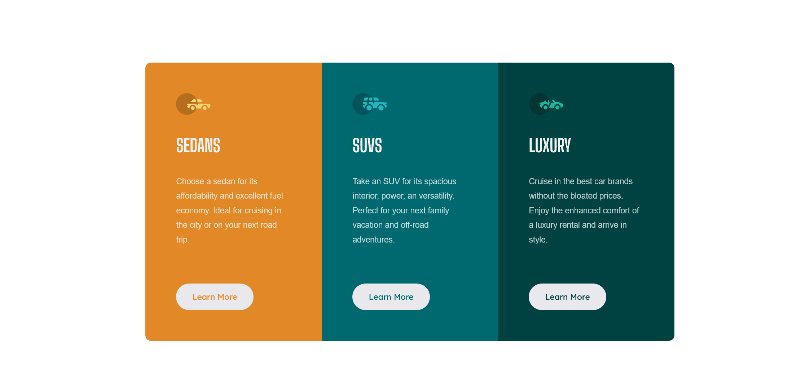

# Frontend Mentor - 3-column preview card component solution

This is a solution to the [3-column preview card component challenge on Frontend Mentor](https://www.frontendmentor.io/challenges/3column-preview-card-component-pH92eAR2-). Frontend Mentor challenges help you improve your coding skills by building realistic projects. 

## Table of contents

- [Overview](#overview)
  - [The challenge](#the-challenge)
  - [Screenshot](#screenshot)
  - [Links](#links)
- [My process](#my-process)
  - [Built with](#built-with)
  - [What I learned](#what-i-learned)
  - [Continued development](#continued-development)
- [Author](#author)

## Overview

### The challenge

Users should be able to:

- View the optimal layout depending on their device's screen size
- See hover states for interactive elements

### Screenshot

### Links

- Solution URL: [https://github.com/Alfonso-1701/Three_Column_Preview](https://github.com/Alfonso-1701/Three_Column_Preview)
- Live Site URL: [https://peppy-fudge-8b5df1.netlify.app](https://peppy-fudge-8b5df1.netlify.app)

## My process

Layed out the mark up, afterwards I applied the styles and format it to mobile. Made adjustments with media queries finding breakpoints that worked witht the project. 

### Built with

- Semantic HTML5 markup
- CSS custom properties
- Flexbox
- CSS Grid
- Mobile-first workflow

### What I learned

Was exposed to the underlying components of flex, including how flex has three major attributes. Grow, shrink, and basis. Grow is set to off while shrink is on. When the children shrink, there can be left over space in the parent class that is unused. Grow is put onto the children and can be divied up a ratio, giving one child 2 parts of the free space while others only have one part of free space. 

### Continued development

I have a reasonable understanding of display flex and grid. My goal to to understand the different variables and interactions to be capable of manipulating them quickly and automatically.

## Author

- Website - [Alfonso Alvarez](https://www.linkedin.com/in/alfonso-alvarez-4223b628b/)
- Frontend Mentor - [@Alfonso-1701](https://www.frontendmentor.io/profile/Alfonso-1701)

